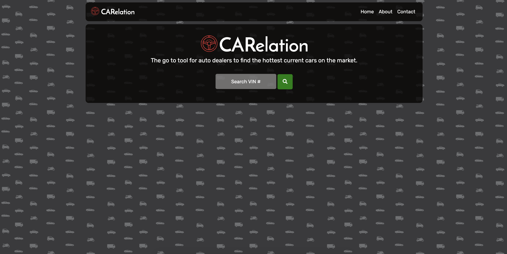
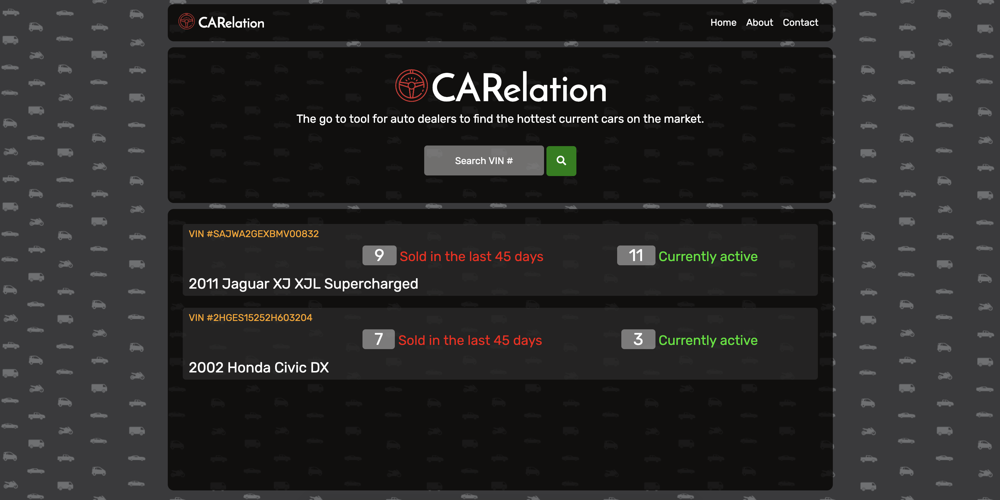

# CARelation

The go to tool for car dealers and business to find the current + hottest cars on the market.Why is this useful? Car dealers and businesses are looking for the best vehicles to invest in and often have to make a quick decision. This is Where CARelation comes in, we provide quick  results that are derived from data that is sourced from over 53,000 Car dealer websites in USA and over 3600 dealer websites in Canada.There are about 6.2M searchable listings (about 2.2M unique VINs) for Used & Certified cars and about 6.6M (about 3.9M unique VINs) New car listings from all over USA.The active inventory set available on target websites is refreshed once every 24 hours. All websites are tracked for changes to the inventory and only those listings that have changes published are crawled afresh. Our analytics are what will take your dealership or business to the next level.

# Developed with

Javascript
jQuery
CSS
Animate.CSS
Sequalized/MYSQL
Marketcheck API
Backend NODE
Various HTTP Calls/Routing
Saved data searches on the backend

# Front Page

# Search Results 

